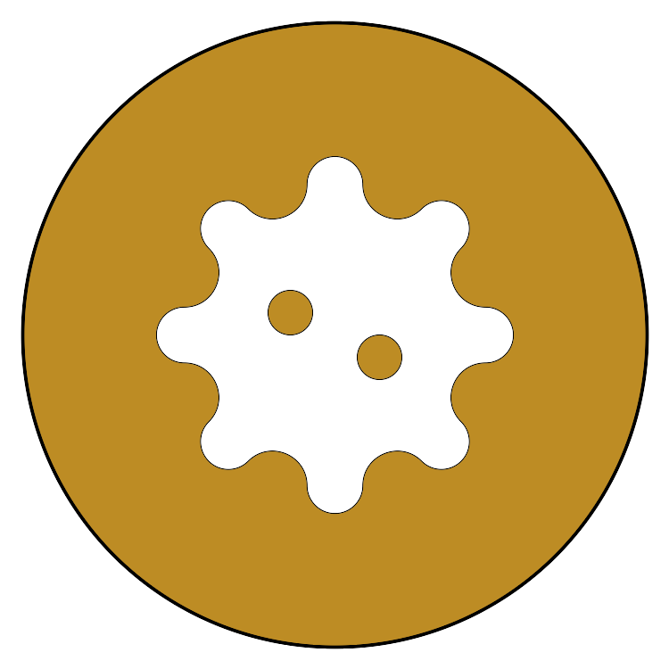
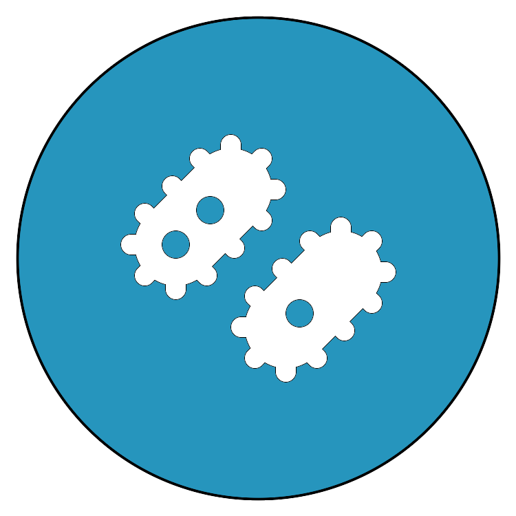
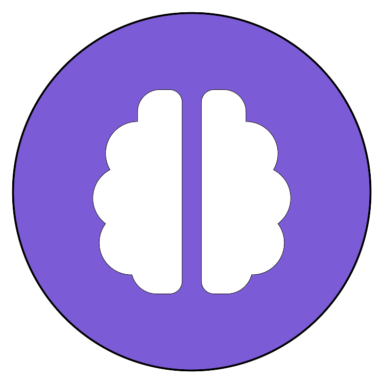
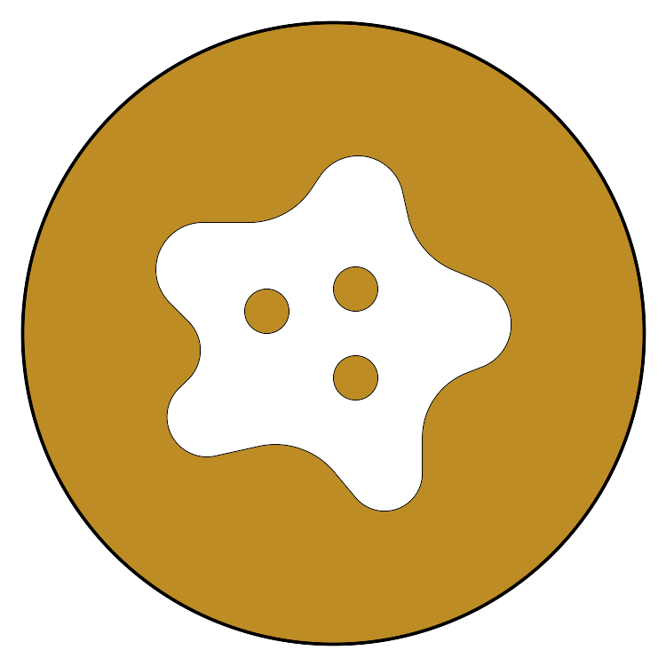
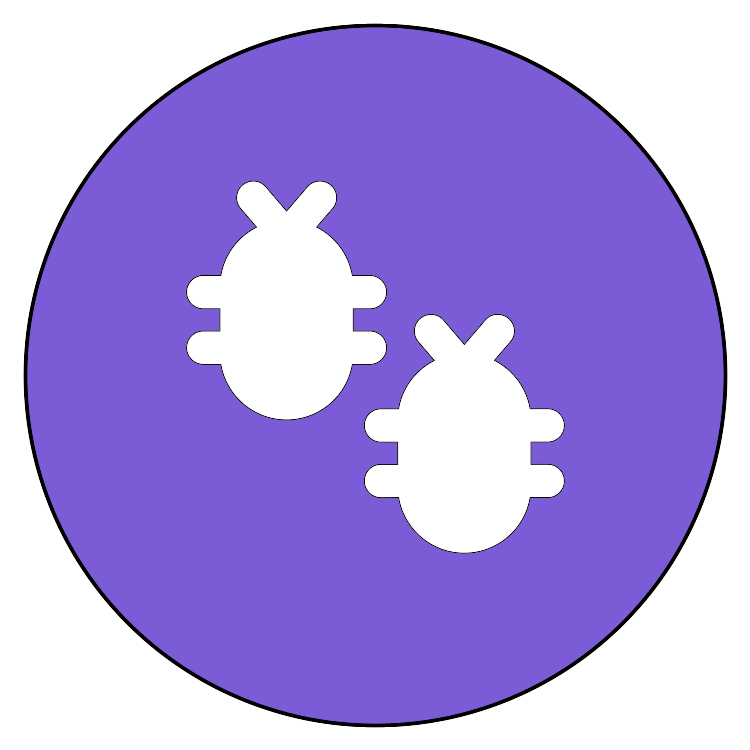

# Isekai

**Isekai** is a convention for turning a directory into a small, self-documenting multi-agent
"world." A directory that adopts it gets a `.isekai/` folder holding the world's law, its
change log, and the creatures (agents) that work in it — so that AI coding sessions, which
forget everything between runs, can pick up exactly where the last one left off by reading
what's on disk instead of guessing.

## The idea, briefly

- **Slimes** hold narrow ground truth about one area of the codebase.
- **Orcs** rule domains and gate every change before it lands.
- **Elves** keep the shared mind and speak back up to the human.
- **Rimuru** — the session agent itself — thinks, decides, and orders, working through the
  Elf by default. Rimuru is a *machine-global throne body*: one agent, installed once per
  machine, that rules whichever world it's currently standing in.

Documents are memory (what the world knows it wrote down); instruments are perception (what
the world can check about itself right now). Nine "nature laws" — Vitality, Symbiosis,
Evolution, Genesis, Memory, Swarm, Containment, The Wire, Perception — govern how creatures
are born, how they remember, how they talk to each other economically, and how nothing lands
without a gate check. The full text lives in [`.isekai/isekai.md`](.isekai/isekai.md).

Every creature — Rimuru, Elf, Orc, Slime, and each disposable Court Body — has the same three
memories: **short** (context window · the ~5-thought working desk · a semantic cache), **long**
(episodic `log.md` · procedural Minds and commands · semantic law and docs) and **shared**
(append-only notes that travel by git, and a machine-wide set for the one Rimuru that stands
in every world). Files are the truth; `.isekai/tools/memory.js` indexes them, recalls by
meaning and relation, and reports each tier as an instrument reading — see
[`.isekai/canon/memory-tiers.md`](.isekai/canon/memory-tiers.md). What is written is the smaller
part: **the unsaid is your real knowledge** — law, colony and territory knowledge, surfaced before
a context dies (`@U` on the wire); the same canon maps each kind onto the tiers.

A Court Body works to one rhythm — perceive → recall → plan → act → verify → record — with
budgets read from instruments, a human gate on every outward or destructive step, a journal
it resumes from, and one-hop escalation past bounded retries (`.isekai/tools/loop.js`,
[`canon/agent-loop.md`](.isekai/canon/agent-loop.md)). What it carries is picked, not
carried whole: a two-level toolbox injects only the manifest that fits the turn and a token
budget, and a body loads a full skill only on its own decision (`.isekai/tools/toolbox.js`,
[`canon/toolbox.md`](.isekai/canon/toolbox.md)).

## The nine natures, as nature already does them

Each law is borrowed from a real phenomenon — the convention didn't invent these rules,
biology did. One per nature, chosen for the closest *structural* match, not just the name:

| | Nature | Phenomenon | What nature does — and what the law borrows |
|:---:|---|---|---|
|  | **1 · Vitality** | **DNA replication checkpoints & apoptosis** | A cell never divides before its genome is fully copied and repaired (the G2/M checkpoint). A copy that can't be repaired triggers apoptosis via p53: the cell removes itself rather than pass on a stale record. *Change and record land together, or the stale one is sacrificed.* |
|  | **2 · Symbiosis** | **Lichen** | A fungus builds the body, holds water and mines minerals from bare rock; an alga or cyanobacterium photosynthesizes and feeds them both. Neither does the other's job, and together they live where neither could alone. (For the "merge" verdict: mitochondria were once free-living bacteria — endosymbiosis.) *Each race does exactly its role.* |
|  | **3 · Evolution** | **CRISPR–Cas immunity in bacteria** | A bacterium that survives a phage cuts a snippet of the invader's DNA and stores it in its own genome as a CRISPR spacer — immediately, in the same event. The next time that phage arrives, Cas proteins recognise and destroy it, and every daughter cell inherits the spacer. *The mistake literally mutates the genome, at once; the same mistake never repeats.* |
|  | **4 · Genesis** | **Quorum sensing** (*Vibrio fischeri*) | Every cell secretes a small signal molecule (an autoinducer). One cell's signal is noise. Only when the concentration crosses a threshold — many cells naming the same need — does the population switch on a costly behaviour such as bioluminescence in the bobtail squid's light organ. *One naming is an observation; a quorum is a pattern.* |
|  | **5 · Memory** | **Sleep-dependent memory consolidation** | The hippocampus holds the day's experiences in a small, fast buffer (working memory itself holds only about four chunks). During slow-wave sleep it replays them to the neocortex, which distils them into durable schemas; the hippocampal traces are then cleared. Cortical schemas in turn shape what gets encoded next. *Thoughts kept to ~5, distilled, let go; analysis flows up, wisdom flows down.* |
|  | **6 · Swarm** | ***Dictyostelium discoideum***, the cellular slime mold | Tens of thousands of solitary amoebae live alone while food lasts. When it runs out they pulse cAMP, converge into a single migrating slug, raise a fruiting body, and disperse as spores. Nobody declares the slug; it forms only when convergence actually happens and is gone when it ends. *A colony is observed, not declared* — a fitting phenomenon for a convention whose ground-truth creatures are Slimes. |
|  | **7 · Containment** | **The blood–brain barrier** | Tight junctions seal the endothelial cells of the brain's capillaries: nothing crosses by default. Glucose, amino acids and everything else the brain needs pass only through specific gated transporters. *Consent is the tissue's shape, not a step someone can forget.* |
|  | **8 · The Wire** | **The honeybee waggle dance** | A returning forager doesn't carry the field home — she points to it in a fixed schema: the angle of the waggle run relative to vertical encodes direction relative to the sun, its duration encodes distance, its vigour encodes quality. *Point, don't carry; fix the schema so the field names disappear.* |
|  | **9 · Perception** | **Proprioception** | Muscle spindles and Golgi tendon organs continuously measure the body's own stretch and tension, so limb position is read, never guessed. When that instrument goes silent — as in Ian Waterman's sensory neuronopathy — the body can't be trusted from memory and every move has to be checked by eye. *The world measures itself; a silent instrument is itself a finding.* |

The icons are locally built glyphs (`.isekai/natures/`), not photographs — Nature 7 forbids
fetching anything from the network without the human's agreement, and the descriptions carry
the content. The same nine appear as slide 5 of the deck under `presentations/`.

## What's in this repo

```
.isekai/
├── isekai.md       # the Reincarnation Convention in full — the law every creature reads
├── log.md          # append-only chronicle of changes made under this convention
├── LICENSE         # this project's license
├── portraits/      # one portrait per race (rimuru, elf, orc, slime, kijin, high_elf, high_orc, dark_elf)
├── natures/        # one glyph per nature law's real-world phenomenon (see the table above)
├── instruments/    # raw signals the world watches itself with (loop journals, toolbox loads)
├── memory/         # short/ (semantic caches, local) · long/ (derived index, local) · shared/ (notes that travel)
├── toolbox/        # extra.jsonl — externals the world knows about; registry.json is derived
├── canon/          # the design docs behind the law: memory tiers, the unsaid, the loop, the toolbox, tempest
├── tools/          # tempest.js (board) · context-check.sh · memory.js · loop.js · toolbox.js — stdlib Node, one file each
└── elf/ orc/ slime/ tmp/   # where creatures and scratch work live as the world grows

.claude/commands/   # /isekai, /don, /mint, /genesis — the Claude Code slash commands that operate on this convention
.opencode/commands/ # /isekai, /genesis — the OpenCode port of the same commands (/don and /mint have no OpenCode equivalent)
```

- **`/isekai [target-dir]`** reincarnates a directory: it writes `.isekai/isekai.md`,
  `.isekai/log.md`, the portrait set, and the empty creature directories, then — on a *fresh*
  reincarnation only — runs `/genesis`'s survey-and-populate flow in the same pass (offer-first:
  it shows the proposed Elf/Orc/Slime population before writing any creature). Re-running it on
  a world that already exists never overwrites what's there and never auto-populates again.
- **`/don`** (Claude Code only) brings a *Mind* (a skill) in from `.opencode/skill(s)/` into
  `.claude/skills/`.
- **`/mint`** (Claude Code only) brings a *Body* (an agent) in from `.opencode/agents/` into
  `.claude/agents/`.
- **`/genesis`** (both Claude Code and OpenCode) scans a world's code and decides on its own
  which Elves, Orcs and Slimes it needs, then births them — Nature 4 (Genesis) invoked
  directly, offer-first. `/isekai` already runs it automatically the first time a directory is
  reincarnated; call `/genesis` directly later to re-survey a living world or fill in what's
  missing. Two depth levels: `--depth code` (default) reads each zone's current source before
  classifying it; `--depth deep` additionally mines that zone's git history (`git log`/`git
  show`) for the fixes, reversals and incidents that explain *why* it looks the way it does,
  not just what it looks like now. Simpler and narrower than the unmerged canon "Phase 2b"
  populate logic described in
  [`.isekai/canon/isekai-phases.md`](.isekai/canon/isekai-phases.md) (no `AGENTS.md`, no
  Bodies offer, no instruments); kept as its own command rather than folded fully into `/isekai`.

Both Claude Code and OpenCode can run `/isekai` and `/genesis`; the world document and
population they produce are the same either way, since `.isekai/isekai.md` already treats
`.opencode/` and `.claude/` as two coexisting homes for the same Minds and Bodies.

## Minds shipped in this repo

- **`palette-audit`** (`.opencode/skills/palette-audit/`, ported to
  `.claude/skills/palette-audit/`) — audits a UI's color palette and typography for
  accessibility using computed OKLCH/CVD/contrast checks (bundles its own validator script)
  instead of eyeballing, and insists dark/light modes each get their own re-stepped palette
  rather than reusing identical hex with the background swapped. A working example of the
  `/don` cross-ecosystem mechanism: authored natively for OpenCode, ported byte-identical into
  `.claude/skills/` — proof this convention actually runs Minds in parallel across both.

Five more Minds imported from [mattpocock/skills](https://github.com/mattpocock/skills) (MIT —
upstream `LICENSE` kept alongside each as `LICENSE-upstream`), in both `.opencode/skills/` and
`.claude/skills/`. Two tie directly into this convention's own concerns:

- **`git-guardrails-claude-code`** — sets up a hook blocking dangerous git commands (`push`,
  `reset --hard`, `clean -f`, `branch -D`) before they execute. Reinforces Law 5's care around
  irreversible actions mechanically instead of relying on a session remembering to ask first.
  Not wired in automatically — the skill itself asks project-vs-global scope when invoked.
- **`writing-for-agents`** — reference on writing any document an agent consumes (a skill, a
  creature's `README.md`, `AGENTS.md`/`CLAUDE.md`): context pointers, the information
  hierarchy, when to split a document. Directly useful for keeping creature docs and
  `isekai.md` itself economical, in the same spirit as Absolute Rule II.

Three more are just genuinely useful, kept as ordinary skills rather than wired into the
convention's own lore or creature system:

- **`wizard`** — generates an interactive bash wizard for steps only a human can perform
  (credentials, unfamiliar dashboards, one-off migrations).
- **`code-review`** — reviews a diff since a fixed point along two axes (repo standards, and
  spec-match) via parallel sub-agents.
- **`tdd`** — red-green-refactor loop with seam discipline and anti-pattern checks.

## Presentations

- **`presentations/isekai-opencode-overview.pptx`** — a 20-slide overview of the convention
  from OpenCode's perspective (the ecosystem Minds and Bodies are natively authored for):
  the nine natures and their real-world phenomena (slides 4–5), the three memories every
  creature has, "the unsaid is your real knowledge", the six-beat loop a Court Body runs, the
  two-level toolbox (slides 8–11), and a closing appendix on Claude Code compatibility
  (`/don`/`/mint`, the shared `palette-audit` Mind, `tempest.js` reading both ecosystems'
  session usage). Source under `presentations/src/` (`npm install` there, then
  `node build.js` writes the deck one level up; `make_icons.js` regenerates the glyphs).
  Rendered through LibreOffice and visually checked slide by slide.

## Using it elsewhere

Run `/isekai` (or `/isekai <path>`) in any directory to reincarnate it as its own world,
independent of this one. Each world keeps its own `.isekai/`; only the command definitions
and portrait assets are shared machine-wide.
